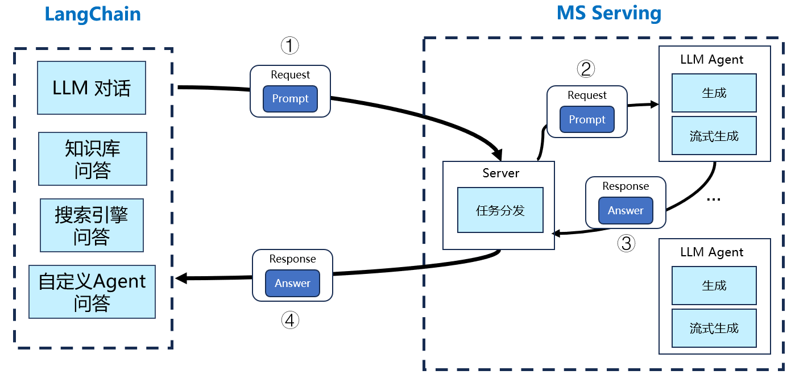

# MindSpore-Langchain 介绍

本项目基于原[LangChain-ChatChat](https://github.com/chatchat-space/Langchain-Chatchat)项目修改而来，添加了 MindSpore 框架的
适配代码。关于 LangChain 的基本配置和依赖，请参看 README_zh.md 或者 README_en.md。本说明主要介绍支持 MindSpore 框架推理相关的
主要修改点。

LangChain 和 MS-Serving 服务是解耦的两个服务。用户输入 Query 后，LangChain 框架会经过一定处理，生成对应的 Prompt，并向 MS-Serving
服务发送包含 Prompt 的请求。MS-Serving 服务收到请求后，将请求分发给对应后端部署的大模型，获取生成的结果后，通过 Response 返回给
LangChain 框架，最终将结果显示给用户。



以下是 LangChain + MS-Serving 知识库详细流程示意图：


# Bert Embedding 模型

本仓库使用 Bert-base 作为基础的 Embedding 模型，而非原项目中默认使用的 [moka-ai/m3e-base](https://huggingface.co/moka-ai/m3e-base)。


该模型依赖 [mindformers 套件](https://gitee.com/mindspore/mindformers)，需要按照教程安装 `mindformers` 套件。
在 [HuggingFace](https://huggingface.co/bert-base-chinese) 上下载中文 Bert-base 权重之后，参考
[文档](https://gitee.com/mindspore/mindformers/blob/dev/docs/model_cards/bert.md) 转换成 `ckpt` 格式的权重。

修改 `configs/model_config.py` 中 `MODEL_PATH` 配置中的 `embed_model` 项中的 `ms-bert-base` 以配置本地权重的路径。

```python
    ...
    "ms-bert-base": "path to checkpoint"
    ...
```

# 配置 MindSpore Serving 服务

本项目后端大模型基于 MindSpore Serving 部署，可以配置 `configs/model_config.py` 中 `ONLINE_LLM_MODEL` 项目下 `mindspore-api`
的 `model_type` 选项来选择后端模型，目前暂时支持 `InternLM-20B`。

MindSpore Serving 服务的 `ip` 和端口地址在 `configs/server_config.py` 中的 `MS_SERVER` 中配置，`ip` 和端口号为启动 MindSpore
Serving 服务时配置的 `ip` 和端口号。

示例如下：

```python
MS_SERVER = {
    "host": "0.0.0.0",
    "port": 1234,
}
```

同时，需要注释掉 `FSCHAT_MODEL_WORKERS` 中的 `zhipu-api` 项，添加 `mindspore-api` 项，并在其中设置端口。
